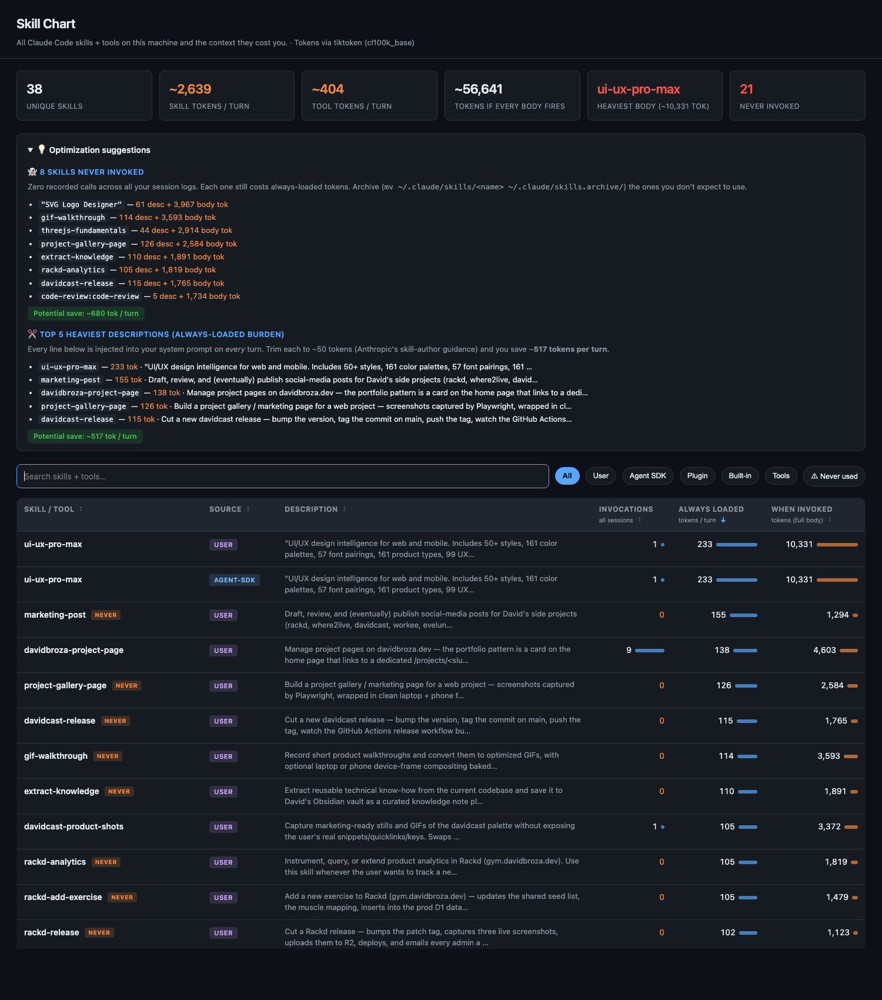

# skillchart

A one-file dashboard for every Claude Code skill installed on your machine — and the **context cost** each one charges you.

  



## Why

Skills are great, but every one of them silently injects its name + description into your system prompt on **every turn**, used or not. After installing a few skill packs, you can easily be paying 4k+ tokens per turn for skills you never invoke. skillchart shows you the bill.

## What it does

Scans these locations and emits a self-contained `dashboard.html`:

- `~/.claude/skills/` — your hand-written skills
- `~/.agents/skills/` — Claude Agent SDK installed skills
- `~/.claude/plugins/cache/<marketplace>/<plugin>/<v>/commands/` — plugin commands
- Built-in skills shipped with the Claude Code CLI

For each skill it shows:

- **Always-loaded tokens** — the description cost, paid every turn
- **When-invoked tokens** — the SKILL.md body cost, paid on `Skill` tool call
- **Disk duplicates** — same skill name in more than one location
- **Top 5 heaviest descriptions** — concrete optimization targets
- **Top 5 heaviest bodies** — what blows up your context the moment a skill fires

Token estimate is `chars / 4` (cl100k-style). Good enough to compare skills against each other and find the fat ones.

## Install

**One-liner (any platform with Python 3.9+):**

```bash
curl -fsSL https://raw.githubusercontent.com/davidbroza/skillchart/main/install.sh | bash
```

**Homebrew:**

```bash
brew install davidbroza/tap/skillchart
```

**From source:**

```bash
git clone https://github.com/davidbroza/skillchart
cd skillchart
python3 build.py
```

Optional: `pip install tiktoken` for ~10× more accurate token counts (the script falls back to `chars/4` if it's not installed).

## Usage

```
skillchart                # build + open dashboard in browser
skillchart --no-open      # build, don't open
skillchart --json         # print scanned data as JSON to stdout
skillchart -o out.html    # write to a specific path
skillchart --fix-dupes    # show identical disk duplicates (dry run)
skillchart --fix-dupes --apply
                          # actually replace duplicates with symlinks
skillchart --no-usage     # skip parsing session logs (faster)
skillchart --version
```

## What you get

- **Per-skill always-loaded vs when-invoked** token counts (tiktoken when available)
- **Invocation counts** parsed from your local session logs (`~/.claude/projects/**/*.jsonl`) — see exactly which skills you've actually used and which sit unused
- **CLI tool descriptions** (Bash, Read, Edit, …) counted alongside skills, since they share the system prompt
- **Snapshot diff** — every run records a snapshot; the next run shows what grew
- **Optimization suggestions** — heaviest descriptions, never-invoked skills, redundant disk copies

The HTML is self-contained — open it in any browser, share it as a single file.

## Optimization playbook

Things skillchart will help you find:

1. **Identical disk duplicates.** A skill installed via the Agent SDK (`~/.agents/skills/<name>/`) often gets a hand-copied twin in `~/.claude/skills/<name>/`. **Don't just delete the `~/.claude/` copy** — the Claude Code CLI only reads `~/.claude/skills/`, so deleting it makes the skill disappear from your sessions. Instead, replace it with a symlink to the canonical SDK-managed copy: `rm -rf ~/.claude/skills/<name> && ln -s ~/.agents/skills/<name> ~/.claude/skills/<name>`. Both runtimes now share one source; SDK updates propagate automatically.
2. **Bloated descriptions.** Anthropic's skill-author guidance is ~50 tokens per description. Rewrite descriptions over ~80 tokens; you'll save tokens on every single turn forever.
3. **Skills you never invoke.** If a skill body is 5k tokens and you've used it twice in a year, archive it.

## Use as a Claude Code skill

A `SKILL.md` is included; copy it to `~/.claude/skills/skillchart/SKILL.md` (or symlink the folder) and you can run `/skillchart` from any session to regenerate and open the dashboard.

## License

MIT.
